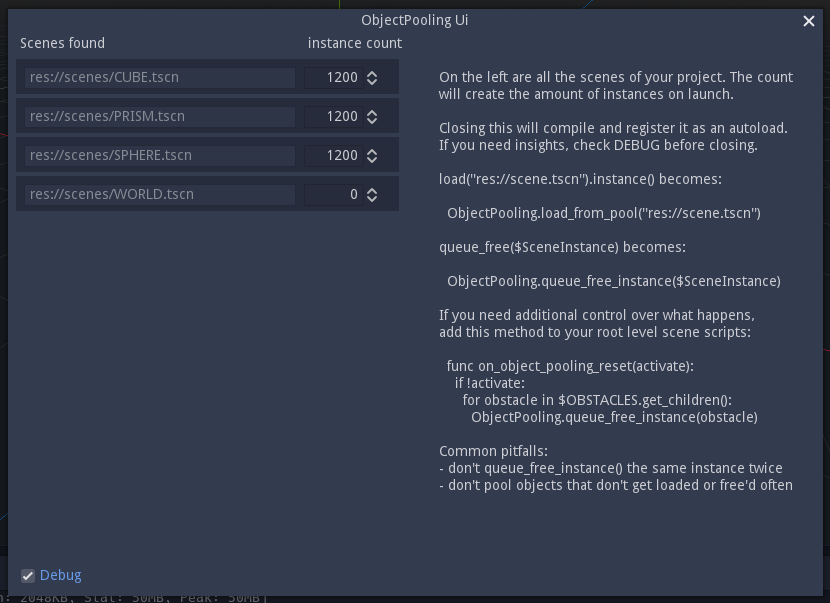
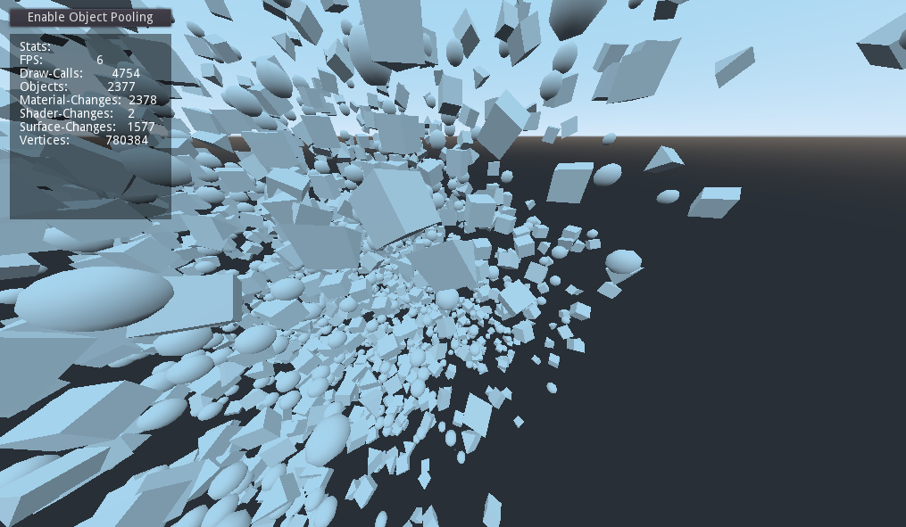

# **novemberdev_object_pooling_godot**

This is an experimental plugin for ObjectPooling in godot.

## Installation

Drop the addons folder into your project and enable the plugin by going to 

**project > Plugins > Check Enable on ObjectPooling**

## Usage

Simply click on ObjectPooling to the top right of your Godot-Editor to open the UI.



## Documentation

On the left are all the scenes of your project. The count 
will create the amount of instances on launch.

Closing this will compile and register it as an autoload. 
If you need insights, check DEBUG before closing.

`load("res://scene.tscn").instance()` becomes:
```
  ObjectPooling.load_from_pool("res://scene.tscn")
```
`queue_free($SceneInstance)` becomes:
```
  ObjectPooling.queue_free_instance($SceneInstance)
```
If you need additional control over what happens, 
add this method to your root level scene scripts:
```
  func on_object_pooling_reset(activate):
    if !activate:
      for obstacle in $OBSTACLES.get_children():
        ObjectPooling.queue_free_instance(obstacle)
```
Common pitfalls:
- don't queue_free_instance() the same instance twice
- don't pool objects that don't get loaded or free'd often
- use on_object_pooling_reset to reset AnimationTree OneShotNodes and States

## Example

I spawn a monster:

```
func spawn_monster(position: Vector3, health = 300, speed = 25, damage = 30, is_crawler = true):
	var m = ObjectPooling.load_from_pool("res://scenes/Monster.tscn")
	m.health = health
	m.speed = speed
	m.damage = damage
	m.is_crawler = is_crawler
	Globals.world.add_child(m)
	m.global_transform.origin = position
	return m
```

Inside the monster script, I reset it's state if it's being reused or call queue_free():

```
func on_object_pooling_reset(activate):
	if !activate:
		set_process(false)
	else:
		set_process(true)
		opacity = 1.0
		$model/AnimationTree.active = true
		$model/AnimationTree.set("parameters/die/active", false)

func die():
	$model/AnimationTree.active = false
	ObjectPooling.queue_free_instance(self)
```

## How does it work?

The ObjectPooler scans your Project for scene-Files and then displays them in the UI. Every scene has a number of instances assinged to it. On boot, the ObjectPooler will create that amount of instances for you to use. If you close the UI, it will automatically register itself as an autoload for your convenience.

More details on that are within the UI.

# Notes to this demo
This demo uses unique materials on purpose. Godot is very fast at instancing scenes but not at initializing them. I believe it is shader compilation that adds latency once the object can be seen, this plugin makes the stuttering go away. I tested this in Nov Run, a game I deployed to the Google Play store. If your pc is really fast, you may not even notice it, but in the real world with complex scenes, it really shows.

# Screenshots

## With ObjectPooling enabled:


## Without ObjectPooling enabled:


# Updates

## October 2021

I create games in godot 3.3.4 and once I reach a certain scale, I still encounter the same performance issues (stuttering). 
Once I put ObjectPooling in, they completely go away. When you plan on adding it into an existing project, make sure to use the reset function in your script:

```
func on_object_pooling_reset(activate):
	if !activate:
		set_process(false)
	else:
		set_process(true)
		opacity = 1.0
		$model/AnimationTree.active = true
		$model/AnimationTree.set("parameters/die/active", false)
```

to avoid weird side effects. You basically reset the entity's variables back to their initial state. 
Take note of the AnimationTree here - the tree has a OneShotNode that has call-method-keyframes. If you reactivate it, it will run the
same method again and to avoid that, you reset the OneShotNode back to false.